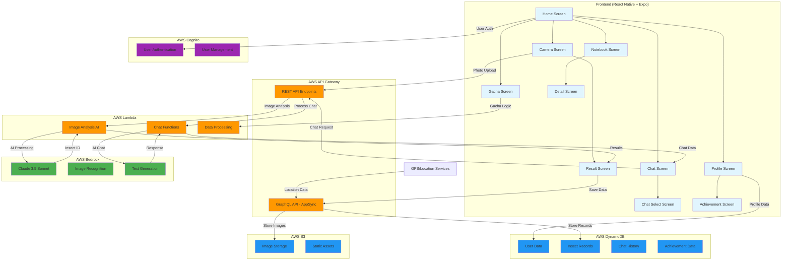

# 虫図鑑アプリ

このアプリは子供向けの虫図鑑作成・学習アプリです。React Native と Expo で構築されています。AI を用いた画像解析やチャットにより虫について楽しく学べます。

## 主な機能

- **写真アップロードと虫判定**: 撮影した虫の写真をアップロードすると、AI が学名・和名・科名を自動判定して表示します。
- **チャット型知識探求**: 名前をもとに博士キャラクターがやさしい言葉で虫を説明し、音声再生も行います。次に知りたいことの候補も提示されます。
- **チャット要約・ノート**: 会話終了後、AI が内容を要約して自分だけの虫図鑑ノートに保存します。編集も可能です。
- **図鑑編集**: ユーザーが図鑑内容を自由に編集・追加できます。
- **追加提案機能(予定)**: ゲーミフィケーション要素や地図連携、共有機能などを検討しています。

## 開発環境の準備

1. **Node.js** と **npm** をインストールしてください。
2. **Expo CLI** をグローバルにインストールします。

```bash
npm install -g expo-cli
```

3. 依存パッケージをインストールします。

```bash
npm install
```

4. **Expo Go** アプリをスマートフォンにインストールすると、実機で簡単にテストできます。
5. 開発サーバーを起動します。

```bash
npx expo start
```

表示される QR コードを Expo Go で読み取るとアプリを実行できます。

6. アーキテクチャ図

# 虫図鑑アプリ アーキテクチャ図



## システム構成要素

### Frontend (React Native + Expo)

- **Home Screen**: メイン画面、撮影ボタン
- **Camera Screen**: 虫の撮影機能
- **Result Screen**: AI 分析結果表示
- **Chat Screen**: 虫博士・フレンドとのチャット
- **Notebook Screen**: 図鑑一 ��� 表示
- **Profile Screen**: ユーザープロフィール・実績

### Backend (AWS)

- **API Gateway**: RESTful API エンドポイント
- **AppSync**: GraphQL API、リアルタイム同期
- **Lambda Functions**:
  - 画像解析 AI 処理
  - チャット機能
  - データ処理ロジック
- **Bedrock**: Claude 3.5 Sonnet による AI 処 ��
- **S3**: 画像ファイル保存
- **DynamoDB**: ユーザーデータ、虫記録、チャット履歴
- **Cognito**: ユーザー認証・管理

### データフロー

1. **虫撮影**: Camera → S3 → Lambda → Bedrock → Result
2. **チャット**: Chat → Lambda → Bedrock → Response
3. **データ保存**: Result → AppSync → DynamoDB
4. **認証**: Frontend → Cognito → Backend

### 主要機能

- 📸 **画像解析**: Bedrock Claude 3.5 Sonnet
- 💬 **AI チャット**: 虫博士・フレンドキャラクター
- 📚 **図鑑管理**: 発見した虫の記録・編集
- 🎯 **実績システム**: ゲーミフィケーション要素
- 🎰 **ガチャ機能**: ポイント消費型コンテンツ

## 注意

- 初回起動時は必要なパッケージのダウンロードが走るため時間がかかる場合があります。
- 開発用コマンド `npm run lint` ではネットワークアクセスが必要です。Codex 環境では失敗することがあります。

## ライセンス

このリポジトリはハッカソン用途での利用を想定しています。
