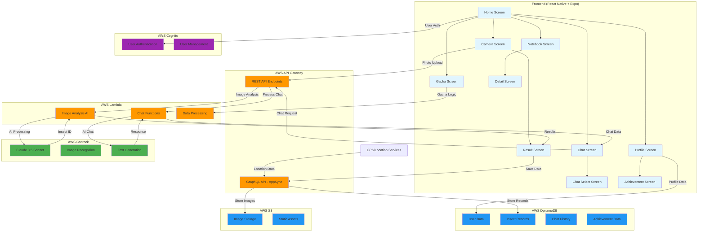

# 虫図鑑アプリ アーキテクチャ図

## システム構成要素

### Frontend (React Native + Expo)
- **Home Screen**: メイン画面、撮影ボタン
- **Camera Screen**: 虫の撮影機能
- **Result Screen**: AI分析結果表示
- **Chat Screen**: 虫博士・フレンドとのチャット
- **Notebook Screen**: 図鑑一���表示
- **Profile Screen**: ユーザープロフィール・実績

### Backend (AWS)
- **API Gateway**: RESTful API エンドポイント
- **AppSync**: GraphQL API、リアルタイム同期
- **Lambda Functions**: 
  - 画像解析AI処理
  - チャット機能
  - データ処理ロジック
- **Bedrock**: Claude 3.5 Sonnet による AI 処��
- **S3**: 画像ファイル保存
- **DynamoDB**: ユーザーデータ、虫記録、チャット履歴
- **Cognito**: ユーザー認証・管理

### データフロー
1. **虫撮影**: Camera → S3 → Lambda → Bedrock → Result
2. **チャット**: Chat → Lambda → Bedrock → Response
3. **データ保存**: Result → AppSync → DynamoDB
4. **認証**: Frontend → Cognito → Backend

### 主要機能
- 📸 **画像解析**: Bedrock Claude 3.5 Sonnet
- 💬 **AI チャット**: 虫博士・フレンドキャラクター
- 📚 **図鑑管理**: 発見した虫の記録・編集
- 🎯 **実績システム**: ゲーミフィケーション要素
- 🎰 **ガチャ機能**: ポイント消費型コンテンツ